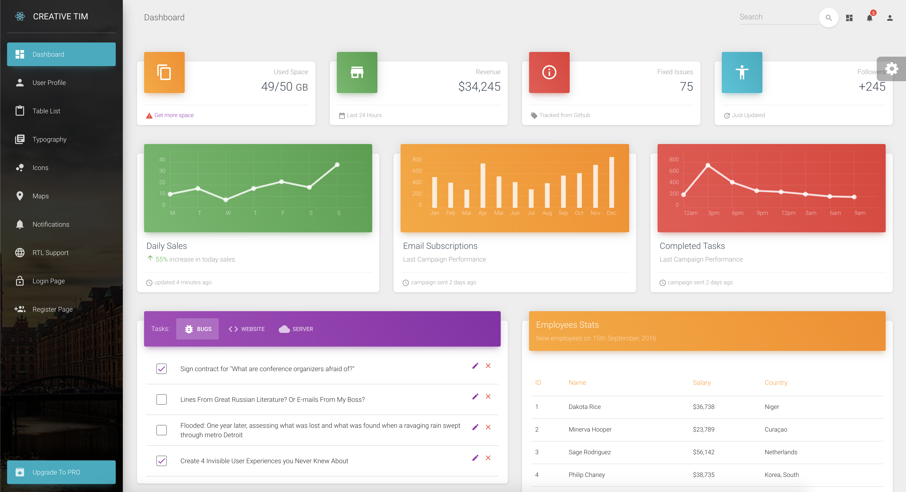
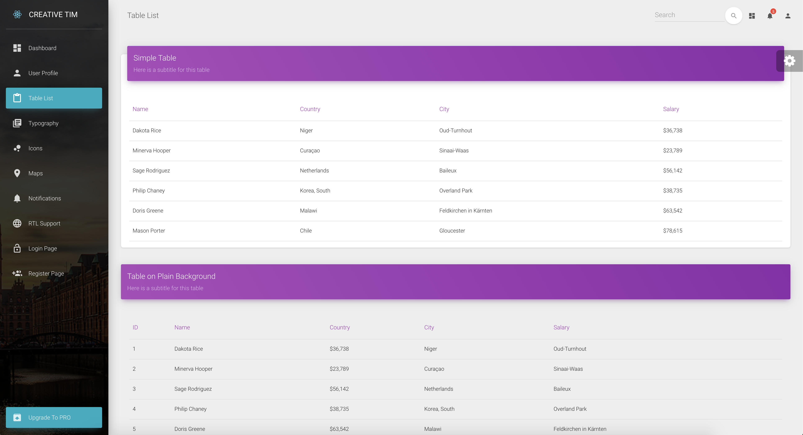

# [Material Dashboard React](https://www.creative-tim.com/live/material-dashboard-react-nodejs/dashboard)


Start your development with Material Dashboard React Nodejs, a free Material-UI Admin built for Node.js framework, the newest go-to technology for top companies. Creative Tim (https://www.creative-tim.com/) partnered with Udevoffice (https://udevoffice.com/) to provide a fully coded “frontend + backend” solution for you. It features a huge number of components that can help you create amazing websites and brings with itself innumerable advantages: the lightweight, fast, scalable and modern way to execute your next top app. Material Dashboard React Nodejs comes with 30 implemented frontend components, which you can combine and modify to your liking using SASS files. Every element has multiple states for colour, style, hover and focus. Material Dashboard Laravel uses a framework built by our friend Federico - Bootstrap Material Design (http://fezvrasta.github.io/bootstrap-material-design/), who did an amazing job creating the backbone for the material effects, animations, ripples, and transitions. Big thanks to his team for the effort and forward thinking they put into it. The package saves you tons of time. Instead of investing time in doing the frontend-backend integration, you have a boilerplate which does the heavy lifting for you. *COMPLEX DOCUMENTATION* Each element is well presented in very complex documentation. You can check the components [here](#documentation) and the foundation. *Example Pages* If you want to get inspiration or just show something directly to your clients, you can jump-start your development with our pre-built example pages. You will be able to quickly set up the basic structure for your web project. View example pages [here](#demo). 

Special thanks go to:
+ [React-chartist](https://github.com/fraserxu/react-chartist) for the wonderful charts.

We are very excited to share this dashboard with you and we look forward to hearing your feedback!

You can find the Github Repo here.

## Table of Contents

* [Versions](#versions)
* [Demo](#demo)
* [Quick Start](#quick-start)
* [Documentation](#documentation)
* [File Structure](#file-structure)
* [Browser Support](#browser-support)
* [Resources](#resources)
* [Reporting Issues](#reporting-issues)
* [Technical Support or Questions](#technical-support-or-questions)
* [Licensing](#licensing)
* [Useful Links](#useful-links)


## Versions

[](https://www.creative-tim.com/product/material-dashboard)
[](https://www.creative-tim.com/product/material-dashboard-react-nodejs)
[](https://www.creative-tim.com/product/vue-material-dashboard)
[](https://www.creative-tim.com/product/material-dashboard-angular2)


| HTML | React | Vue | Angular |
| --- | --- | --- | --- |
| [](https://www.creative-tim.com/product/material-dashboard) | [](https://www.creative-tim.com/product/material-dashboard-react-nodejs) | [](https://www.creative-tim.com/product/vue-material-dashboard) | [](https://www.creative-tim.com/product/material-dashboard-angular2)

## Demo

| Dashboard | User Profile | Tables | Maps | Notification |
| --- | --- | --- | --- | --- |
| [](https://www.creative-tim.com/live/material-dashboard-react-nodejs/dashboard) | [](https://www.creative-tim.com/live/material-dashboard-react-nodejs/user) | [](https://www.creative-tim.com/live/material-dashboard-react-nodejs/table) | [](https://www.creative-tim.com/live/material-dashboard-react-nodejs/maps) | [](https://www.creative-tim.com/live/material-dashboard-react-nodejs/notifications)

[View More](https://www.creative-tim.com/live/material-dashboard-react-nodejs/dashboard).


## Quick start

Quick start options:

- `npm i material-dashboard-react`
- Clone the repo: `git clone https://github.com/creativetimofficial/material-dashboard-react-nodejs.git`.
- [Download from Github](https://github.com/creativetimofficial/material-dashboard-react-nodejs/archive/master.zip).
- [Download from Creative Tim](https://www.creative-tim.com/product/material-dashboard-react-nodejs).


## Documentation
The documentation for the Material Dashboard React is hosted at our [website](https://www.creative-tim.com/live/material-dashboard-react-nodejs/documentation/tutorial).


## File Structure

Within the download you'll find the following directories and files:

```
material-dashboard-react-app
.
├── CHANGELOG.md
├── ISSUE_TEMPLATE.md
├── LICENSE.md
├── README.md
├── bower.json
├── package.json
├── documentation
│   ├── assets
│   └── tutorial-components.html
├── public
│   ├── favicon.ico
│   ├── index.html
│   └── manifest.json
└── src
    ├── index.js
    ├── logo.svg
    ├── routes.js
    ├── assets
    │   ├── css
    │   ├── github
    │   ├── img
    │   │   └── faces
    │   └── jss
    │       ├── material-dashboard-react
    │       │   ├── components
    │       │   ├── layouts
    │       │   └── views
    │       └── material-dashboard-react.jsx
    ├── components
    │   ├── Card
    │   │   ├── Card.jsx
    │   │   ├── CardAvatar.jsx
    │   │   ├── CardBody.jsx
    │   │   ├── CardFooter.jsx
    │   │   ├── CardHeader.jsx
    │   │   └── CardIcon.jsx
    │   ├── CustomButtons
    │   │   └── Button.jsx
    │   ├── CustomInput
    │   │   └── CustomInput.jsx
    │   ├── CustomTabs
    │   │   └── CustomTabs.jsx
    │   ├── FixedPlugin
    │   │   └── FixedPlugin.jsx
    │   ├── Footer
    │   │   └── Footer.jsx
    │   ├── Grid
    │   │   ├── GridContainer.jsx
    │   │   └── GridItem.jsx
    │   ├── Navbars
    │   │   ├── AdminNavbarLinks.jsx
    │   │   ├── Navbar.jsx
    │   │   └── RTLNavbarLinks.jsx
    │   ├── Sidebar
    │   │   └── Sidebar.jsx
    │   ├── Snackbar
    │   │   ├── Snackbar.jsx
    │   │   └── SnackbarContent.jsx
    │   ├── Table
    │   │   └── Table.jsx
    │   ├── Tasks
    │   │   └── Tasks.jsx
    │   └── Typography
    │       ├── Danger.jsx
    │       ├── Info.jsx
    │       ├── Muted.jsx
    │       ├── Primary.jsx
    │       ├── Quote.jsx
    │       ├── Success.jsx
    │       └── Warning.jsx
    ├── layouts
    │   ├── Admin.jsx
    │   └── RTL.jsx
    ├── variables
    │   ├── charts.jsx
    │   └── general.jsx
    └── views
        ├── Dashboard
        │   └── Dashboard.jsx
        ├── Icons
        │   └── Icons.jsx
        ├── Maps
        │   └── Maps.jsx
        ├── Notifications
        │   └── Notifications.jsx
        ├── RTLPage
        │   └── RTLPage.jsx
        ├── TableList
        │   └── TableList.jsx
        ├── Typography
        │   └── Typography.jsx
        ├── UpgradeToPro
        │   └── UpgradeToPro.jsx
        └── UserProfile
            └── UserProfile.jsx
```

## Browser Support

At present, we officially aim to support the last two versions of the following browsers:

    


## Resources
- Demo: https://www.creative-tim.com/live/material-dashboard-react-nodejs
- Download Page: https://www.creative-tim.com/product/material-dashboard-react-nodejs
- Documentation: https://www.creative-tim.com/live/material-dashboard-react-nodejs/documentation/tutorial
- License Agreement: https://www.creative-tim.com/license
- Support: https://www.creative-tim.com/contact-us
- Issues: [Github Issues Page](https://github.com/creativetimofficial/material-dashboard-react-nodejs/issues)
- [Material Kit React - For Front End Development](https://www.creative-tim.com/product/material-kit-react?ref=github-mdr-free)

## Reporting Issues
We use GitHub Issues as the official bug tracker for the Material Dashboard React. Here are some advices for our users that want to report an issue:

1. Make sure that you are using the latest version of the Material Dashboard React. Check the CHANGELOG from your dashboard on our [website](https://www.creative-tim.com/).
2. Providing us reproducible steps for the issue will shorten the time it takes for it to be fixed.
3. Some issues may be browser specific, so specifying in what browser you encountered the issue might help.

## Technical Support or Questions

If you have questions or need help integrating the product please [contact us](https://www.creative-tim.com/contact-us) instead of opening an issue.

## Licensing

- Copyright 2018 Creative Tim (https://www.creative-tim.com)
- Licensed under MIT (https://github.com/creativetimofficial/material-dashboard-react-nodejs/blob/master/LICENSE.md)

## Useful Links

More products from Creative Tim: <https://www.creative-tim.com/products>

Tutorials: <https://www.youtube.com/channel/UCVyTG4sCw-rOvB9oHkzZD1w>

Freebies: <https://www.creative-tim.com/products>

Affiliate Program (earn money): <https://www.creative-tim.com/affiliates/new>

Social Media:

Twitter: <https://twitter.com/CreativeTim>

Facebook: <https://www.facebook.com/CreativeTim>

Dribbble: <https://dribbble.com/creativetim>

Google+: <https://plus.google.com/+CreativetimPage>

Instagram: <https://instagram.com/creativetimofficial>
