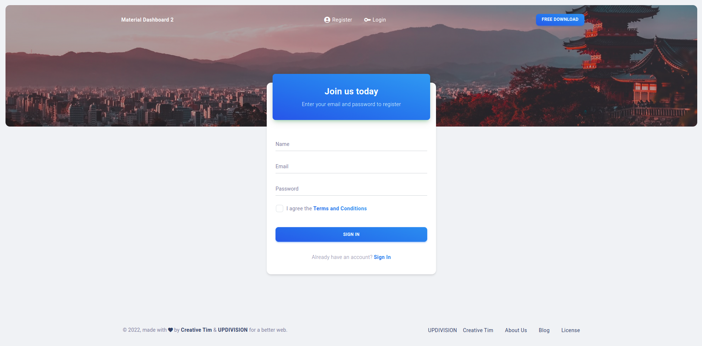
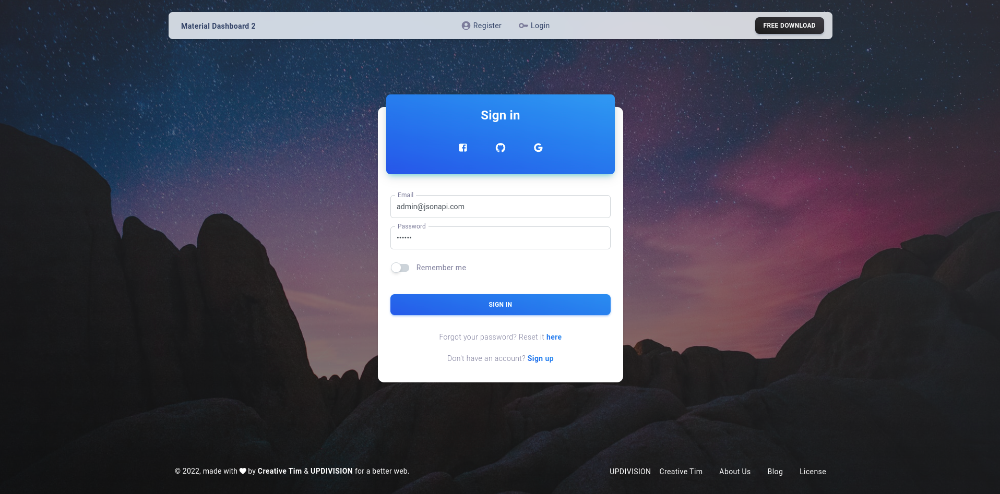
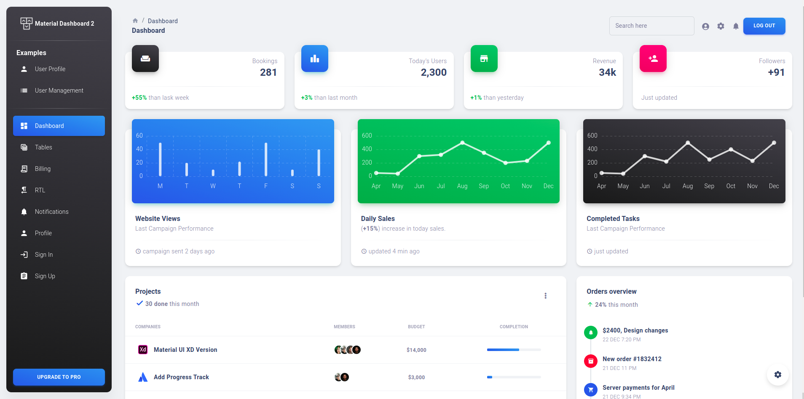

# [Material Dashboard 2 React NodeJS API](https://material-dashboard-react-nodejs.creative-tim.com) [](https://twitter.com/intent/tweet?text=Check%20Material%20Dashboard%20%20PRO%20React%20made%20by%20%40CreativeTim%20and%20%40UPDIVISION%20%23webdesign%20%23dashboard%20%23react%20%23mui&url=https%3A%2F%2Fwww.creative-tim.com%2Fproduct%2Fmaterial-dashboard-react-node)

 [](https://github.com/creativetimofficial/material-dashboard-react-nodejs/issues?q=is%3Aopen+is%3Aissue) [](https://github.com/creativetimofficial/material-dashboard-react-nodejs/issues?q=is%3Aissue+is%3Aclosed)


[](https://www.creative-tim.com/product/material-dashboard-react-nodejs)

**Documentation built by Developers**

Each element is well presented in very complex documentation.

You can read more about the [documentation here](https://material-dashboard-react-node-docs.creative-tim.com/react/login/material-dashboard-node/).

**Example Pages**

If you want to get inspiration or just show something directly to your clients, you can jump-start your development with our pre-built example pages. You will be able to quickly set up the basic structure for your web project.

View [example pages here](https://material-dashboard-react-nodejs.creative-tim.com/auth/login).

**HELPFUL LINKS**

- View [Github Repository](https://github.com/creativetimofficial/material-dashboard-react-nodejs)
- Check [FAQ Page](https://www.creative-tim.com/faq)

#### Special thanks

During the development of this dashboard, we have used many existing resources from awesome developers. We want to thank them for providing their tools open source:

- [MUI](https://mui.com/) - The React UI library for faster and easier web development.
- [React ChartJS 2](http://reactchartjs.github.io/react-chartjs-2/#/) - Simple yet flexible React charting for designers & developers.
- [ChromaJS](https://gka.github.io/chroma.js/) - A small-ish zero-dependency JavaScript library for all kinds of color conversions and color scales.

Let us know your thoughts below. And good luck with development!

If you want to get more features, go PRO with [Material Dashboard 2 PRO React NodeJS API](https://www.creative-tim.com/product/material-dashboard-pro-react-nodejs).

## Table of Contents

- [Versions](#versions)
- [Demo](#demo)
- [Quick Start](#quick-start)
- [Documentation](#documentation)
- [Login](#login)
- [Register](#register)
- [Forgot Password](#forgot-password)
- [Reset Password](#reset-password)
- [User Profile](#user-profile)
- [File Structure](#file-structure)
- [Browser Support](#browser-support)
- [Resources](#resources)
- [Reporting Issues](#reporting-issues)
- [Technical Support or Questions](#technical-support-or-questions)
- [Licensing](#licensing)
- [Useful Links](#useful-links)

## Versions

[](https://www.creative-tim.com/product/material-dashboard-pro-react?ref=readme-mdpr)
[](https://www.creative-tim.com/product/react-material-dashboard-pro-laravel?ref=readme-mdpr)
[](https://www.creative-tim.com/product/material-dashboard-pro-react-nodejs?ref=readme-mdpr)

| React + Laravel JSON:API                                                                                                                                                                                                                                                   | React + NodeJS                                                                                                                                                                                                                                                               |
| ------------------------------------------------------------------------------------------------------------------------------------------------------------------------------------------------------------------------------------------------------------------ | -------------------------------------------------------------------------------------------------------------------------------------------------------------------------------------------------------------------------------------------------------------------- |
| [](https://react-material-dashboard-laravel.creative-tim.com/auth/login?ref=readme-mdpr) | [](https://material-dashboard-react-nodejs.creative-tim.com/auth/login?ref=readme-mdpr) |


| React                                                                                                                                                                                                                                  |
| ------------------------------------------------------------------------------------------------------------------------------------------------------------------------------------------------------------------------------------------------------------------ |
| [](https://demos.creative-tim.com/material-dashboard-react/#/dashboard?ref=readme-mdpr) |

## Demo

| Register                                                                                                                                       | Login                                                                                                                                    | Dashboard                                                                                                                                   |
| ---------------------------------------------------------------------------------------------------------------------------------------------- | ---------------------------------------------------------------------------------------------------------------------------------------- | ------------------------------------------------------------------------------------------------------------------------------------------- |
| [](https://material-dashboard-react-nodejs.creative-tim.com/auth/register) | [](https://material-dashboard-react-nodejs.creative-tim.com/auth/login) | [](https://material-dashboard-react-nodejs.creative-tim.com/dashboard) |

| Forgot Password Page                                                                                                                                         | Reset Password Page                                                                                                                    | Profile Page                                                                                                                                 |
| ------------------------------------------------------------------------------------------------------------------------------------------------------------ | -------------------------------------------------------------------------------------------------------------------------------------- | -------------------------------------------------------------------------------------------------------------------------------------------- |
| [](https://material-dashboard-react-nodejs.creative-tim.com/auth/forgot-password) | [](https://material-dashboard-react-nodejs.creative-tim.com) | [](https://material-dashboard-react-nodejs.creative-tim.com/user-profile) |

[View More](https://react-material-dashboard-laravel.creative-tim.com)

## Quick start

## Prerequisites

For your local development you need to have `Node.js` and `npm` version 16 or above installed and a registered MongoDB collection:
- For Windows: https://phoenixnap.com/kb/install-node-js-npm-on-windows
- Linux & Mac: https://updivision.com/blog/post/guide-what-is-lamp-and-how-to-install-it-on-ubuntu-and-macos

## ExpressJS API Backend Installation

To install the project you need to have version 16 of Node.js and npm version 8. The first step is to run `npm install` command. Next you need to copy the `.env.example` file and name it `.env`. There are the variables for the database and the URLs:
- DB_LINK="mongodb-link-to-connect"

- JWT_SECRET="token"

- APP_URL_CLIENT= with the default value of http://localhost:3000
- APP_URL_API= with the default value of http://localhost:8080

## Material React Frontend Installation

1. Set up your api for the project
2. Download and Install NodeJs LTS version from [NodeJs Official Page](https://nodejs.org/en/download/).
3. Navigate to the root ./ directory of the product and run `yarn install` or `npm install` to install our local dependencies.
4. Add in your projeact an .env file with the variables
 - `REACT_APP_URL=your-react-project`
 - `REACT_APP_API_URL=the-path-of-the-api`
 - `REACT_APP_IS_DEMO=false` if you don't want any restrictions and true if you want
5. In `package.json` in the `proxy` variable add the right path to your API
6. Run `yarn start` or `npm start`

## Documentation

The documentation for the Material Dashboard is hosted at our [website](https://material-dashboard-react-node-docs.creative-tim.com/react/overview/material-dashboard-node/?ref=readme-mdpr).

The documentation for the ExpressJS API is hosted [here](https://documenter.getpostman.com/view/8138626/Uze1virp).

## Login

If a user is not logged in can access only the authentication pages: Login, Register and Forgot Password. By default, there **admin@jsonapi.com** with password **secret** as credentials.
For authentication context and protected routes were used to keep track of the state of the users. Axios together with an http service and helped by an auth service and crud service handled the requests. The **/src/service** keeps the logic of the services while **/src/context** has the logic for the different contexts used, including the authentication context.

In the **/src/auth/login/index.js** is the logic for logging in an existing user:

```
    try {
      const response = await AuthService.login(myData);
      authContext.login(response.access_token, response.refresh_token);
    } catch (res) {
      if (res.hasOwnProperty("message")) {
        setCredentialsError(res.message);
      } else {
        setCredentialsError(res.errors[0].detail);
      }
    }
```

## Register

It can be added a new user by registration. The user has a name, email, password and role that needs to be added. All the inputs are verified and validated. You can simply access the page with the **Sign up** button or adding **/register** in the url.

In the **/src/auth/register/index.js** is the logic for signing up a new user:

```
    const response = await AuthService.register(myData);

    authContext.login(response.access_token, response.refresh_token);
```

## Forgot Password

In case of forgetting its password, the user can go to a page where he adds the email of the account and an email will be send to that address to help with resetting the password. It can be accessed from the Login page by clicking the **here** button or by adding **/forgot-password**.

In the **/src/auth/forgot-password/index.js** is the logic for requesting a password reset:

```
    try {
      const response = await authService.forgotPassword(myData);
      if (error === false) {
        setNotification(true);
      }
    } catch (err) {
      console.error(err);
      return null;
    }
```

## Reset Password

For resetting the password, the user must acceess the url sent int the email. By adding the new password and the confirmation and then pressing the **channge** button the data of the account is updated. You can go back to login from the button in notification.

In the **/src/auth/reset-password/index.js** is the logic for resetting the password:

```
  useEffect(() => {
    // get the token and email sent in the url
    const queryParams = new URLSearchParams(window.location.search);
    setToken(queryParams.get("token"));
    setEmail(queryParams.get("email"));
  }, []);
```

## User Profile

From the sidenav, in the CRUDs section, or by adding **/cruds/user-profile** in the url, the User Profile is a dynamic page where the user can add details about him: profile image, name, email or change password. Validation is added for every input.

In the **/src/services/auth-serivce** you can find the routes sets for the request and in the **/src/cruds/user-profile** is the component for the editing the profile details.

```
  getProfile = async() => {
    const getProfile = 'me';
    return await HttpService.get(getProfile);
  }

  updateProfile = async (newInfo) => {
    const updateProfile = "me";
    return await HttpService.patch(updateProfile, newInfo);
  }
```

### What's included

Within the download you'll find the following directories and files:

```
./src
├── App.js
├── assets
│   ├── images
│   │   ├── apple-icon.png
│   │   ├── bg-profile.jpeg
│   │   ├── bg-reset-cover.jpeg
│   │   ├── bg-sign-in-basic.jpeg
│   │   ├── bg-sign-up-cover.jpeg
│   │   ├── bruce-mars.jpg
│   │   ├── favicon.png
│   │   ├── home-decor-1.jpg
│   │   ├── home-decor-2.jpg
│   │   ├── home-decor-3.jpg
│   │   ├── home-decor-4.jpeg
│   │   ├── icons
│   │   │   └── flags
│   │   │       ├── AU.png
│   │   │       ├── BR.png
│   │   │       ├── DE.png
│   │   │       ├── GB.png
│   │   │       └── US.png
│   │   ├── illustrations
│   │   │   └── pattern-tree.svg
│   │   ├── ivana-square.jpg
│   │   ├── kal-visuals-square.jpg
│   │   ├── logo-ct-dark.png
│   │   ├── logo-ct.png
│   │   ├── logos
│   │   │   ├── gray-logos
│   │   │   │   ├── logo-coinbase.svg
│   │   │   │   ├── logo-nasa.svg
│   │   │   │   ├── logo-netflix.svg
│   │   │   │   ├── logo-pinterest.svg
│   │   │   │   ├── logo-spotify.svg
│   │   │   │   └── logo-vodafone.svg
│   │   │   ├── mastercard.png
│   │   │   └── visa.png
│   │   ├── marie.jpg
│   │   ├── small-logos
│   │   │   ├── bootstrap.svg
│   │   │   ├── creative-tim.svg
│   │   │   ├── devto.svg
│   │   │   ├── github.svg
│   │   │   ├── google-webdev.svg
│   │   │   ├── icon-bulb.svg
│   │   │   ├── logo-asana.svg
│   │   │   ├── logo-atlassian.svg
│   │   │   ├── logo-invision.svg
│   │   │   ├── logo-jira.svg
│   │   │   ├── logo-slack.svg
│   │   │   ├── logo-spotify.svg
│   │   │   └── logo-xd.svg
│   │   ├── team-1.jpg
│   │   ├── team-2.jpg
│   │   ├── team-3.jpg
│   │   ├── team-4.jpg
│   │   └── team-5.jpg
│   ├── theme
│   │   ├── base
│   │   │   ├── borders.js
│   │   │   ├── boxShadows.js
│   │   │   ├── breakpoints.js
│   │   │   ├── colors.js
│   │   │   ├── globals.js
│   │   │   └── typography.js
│   │   ├── components
│   │   │   ├── appBar.js
│   │   │   ├── avatar.js
│   │   │   ├── breadcrumbs.js
│   │   │   ├── button
│   │   │   │   ├── contained.js
│   │   │   │   ├── index.js
│   │   │   │   ├── outlined.js
│   │   │   │   ├── root.js
│   │   │   │   └── text.js
│   │   │   ├── buttonBase.js
│   │   │   ├── card
│   │   │   │   ├── cardContent.js
│   │   │   │   ├── cardMedia.js
│   │   │   │   └── index.js
│   │   │   ├── container.js
│   │   │   ├── dialog
│   │   │   │   ├── dialogActions.js
│   │   │   │   ├── dialogContent.js
│   │   │   │   ├── dialogContentText.js
│   │   │   │   ├── dialogTitle.js
│   │   │   │   └── index.js
│   │   │   ├── divider.js
│   │   │   ├── flatpickr.js
│   │   │   ├── form
│   │   │   │   ├── autocomplete.js
│   │   │   │   ├── checkbox.js
│   │   │   │   ├── formControlLabel.js
│   │   │   │   ├── formLabel.js
│   │   │   │   ├── input.js
│   │   │   │   ├── inputLabel.js
│   │   │   │   ├── inputOutlined.js
│   │   │   │   ├── radio.js
│   │   │   │   ├── select.js
│   │   │   │   ├── switchButton.js
│   │   │   │   └── textField.js
│   │   │   ├── iconButton.js
│   │   │   ├── icon.js
│   │   │   ├── linearProgress.js
│   │   │   ├── link.js
│   │   │   ├── list
│   │   │   │   ├── index.js
│   │   │   │   ├── listItem.js
│   │   │   │   └── listItemText.js
│   │   │   ├── menu
│   │   │   │   ├── index.js
│   │   │   │   └── menuItem.js
│   │   │   ├── popover.js
│   │   │   ├── sidenav.js
│   │   │   ├── slider.js
│   │   │   ├── stepper
│   │   │   │   ├── index.js
│   │   │   │   ├── stepConnector.js
│   │   │   │   ├── stepIcon.js
│   │   │   │   ├── step.js
│   │   │   │   └── stepLabel.js
│   │   │   ├── svgIcon.js
│   │   │   ├── table
│   │   │   │   ├── tableCell.js
│   │   │   │   ├── tableContainer.js
│   │   │   │   └── tableHead.js
│   │   │   ├── tabs
│   │   │   │   ├── index.js
│   │   │   │   └── tab.js
│   │   │   └── tooltip.js
│   │   ├── functions
│   │   │   ├── boxShadow.js
│   │   │   ├── gradientChartLine.js
│   │   │   ├── hexToRgb.js
│   │   │   ├── linearGradient.js
│   │   │   ├── pxToRem.js
│   │   │   └── rgba.js
│   │   ├── index.js
│   │   └── theme-rtl.js
│   └── theme-dark
│       ├── base
│       │   ├── borders.js
│       │   ├── boxShadows.js
│       │   ├── breakpoints.js
│       │   ├── colors.js
│       │   ├── globals.js
│       │   └── typography.js
│       ├── components
│       │   ├── appBar.js
│       │   ├── avatar.js
│       │   ├── breadcrumbs.js
│       │   ├── button
│       │   │   ├── contained.js
│       │   │   ├── index.js
│       │   │   ├── outlined.js
│       │   │   ├── root.js
│       │   │   └── text.js
│       │   ├── buttonBase.js
│       │   ├── card
│       │   │   ├── cardContent.js
│       │   │   ├── cardMedia.js
│       │   │   └── index.js
│       │   ├── container.js
│       │   ├── dialog
│       │   │   ├── dialogActions.js
│       │   │   ├── dialogContent.js
│       │   │   ├── dialogContentText.js
│       │   │   ├── dialogTitle.js
│       │   │   └── index.js
│       │   ├── divider.js
│       │   ├── form
│       │   │   ├── autocomplete.js
│       │   │   ├── checkbox.js
│       │   │   ├── formControlLabel.js
│       │   │   ├── formLabel.js
│       │   │   ├── input.js
│       │   │   ├── inputLabel.js
│       │   │   ├── inputOutlined.js
│       │   │   ├── radio.js
│       │   │   ├── select.js
│       │   │   ├── switchButton.js
│       │   │   └── textField.js
│       │   ├── iconButton.js
│       │   ├── icon.js
│       │   ├── linearProgress.js
│       │   ├── link.js
│       │   ├── list
│       │   │   ├── index.js
│       │   │   ├── listItem.js
│       │   │   └── listItemText.js
│       │   ├── menu
│       │   │   ├── index.js
│       │   │   └── menuItem.js
│       │   ├── popover.js
│       │   ├── sidenav.js
│       │   ├── slider.js
│       │   ├── stepper
│       │   │   ├── index.js
│       │   │   ├── stepConnector.js
│       │   │   ├── stepIcon.js
│       │   │   ├── step.js
│       │   │   └── stepLabel.js
│       │   ├── svgIcon.js
│       │   ├── table
│       │   │   ├── tableCell.js
│       │   │   ├── tableContainer.js
│       │   │   └── tableHead.js
│       │   ├── tabs
│       │   │   ├── index.js
│       │   │   └── tab.js
│       │   └── tooltip.js
│       ├── functions
│       │   ├── boxShadow.js
│       │   ├── gradientChartLine.js
│       │   ├── hexToRgb.js
│       │   ├── linearGradient.js
│       │   ├── pxToRem.js
│       │   └── rgba.js
│       ├── index.js
│       └── theme-rtl.js
├── auth
│   ├── forgot-password
│   │   └── index.js
│   ├── login
│   │   └── index.js
│   ├── register
│   │   └── index.js
│   └── reset-password
│       └── index.js
├── components
│   ├── MDAlert
│   │   ├── index.js
│   │   ├── MDAlertCloseIcon.js
│   │   └── MDAlertRoot.js
│   ├── MDAvatar
│   │   ├── index.js
│   │   └── MDAvatarRoot.js
│   ├── MDBadge
│   │   ├── index.js
│   │   └── MDBadgeRoot.js
│   ├── MDBox
│   │   ├── index.js
│   │   └── MDBoxRoot.js
│   ├── MDButton
│   │   ├── index.js
│   │   └── MDButtonRoot.js
│   ├── MDInput
│   │   ├── index.js
│   │   └── MDInputRoot.js
│   ├── MDPagination
│   │   ├── index.js
│   │   └── MDPaginationItemRoot.js
│   ├── MDProgress
│   │   ├── index.js
│   │   └── MDProgressRoot.js
│   ├── MDSnackbar
│   │   ├── index.js
│   │   └── MDSnackbarIconRoot.js
│   └── MDTypography
│       ├── index.js
│       └── MDTypographyRoot.js
├── context
│   └── index.js
├── examples
│   ├── Breadcrumbs
│   │   └── index.js
│   ├── Cards
│   │   ├── BlogCards
│   │   │   └── SimpleBlogCard
│   │   │       └── index.js
│   │   ├── InfoCards
│   │   │   ├── DefaultInfoCard
│   │   │   │   └── index.js
│   │   │   └── ProfileInfoCard
│   │   │       └── index.js
│   │   ├── MasterCard
│   │   │   └── index.js
│   │   ├── ProjectCards
│   │   │   └── DefaultProjectCard
│   │   │       └── index.js
│   │   └── StatisticsCards
│   │       └── ComplexStatisticsCard
│   │           └── index.js
│   ├── Charts
│   │   ├── BarCharts
│   │   │   ├── HorizontalBarChart
│   │   │   │   ├── configs
│   │   │   │   │   └── index.js
│   │   │   │   └── index.js
│   │   │   ├── ReportsBarChart
│   │   │   │   ├── configs
│   │   │   │   │   └── index.js
│   │   │   │   └── index.js
│   │   │   └── VerticalBarChart
│   │   │       ├── configs
│   │   │       │   └── index.js
│   │   │       └── index.js
│   │   ├── BubbleChart
│   │   │   ├── configs
│   │   │   │   └── index.js
│   │   │   └── index.js
│   │   ├── DoughnutCharts
│   │   │   └── DefaultDoughnutChart
│   │   │       ├── configs
│   │   │       │   └── index.js
│   │   │       └── index.js
│   │   ├── LineCharts
│   │   │   ├── DefaultLineChart
│   │   │   │   ├── configs
│   │   │   │   │   └── index.js
│   │   │   │   └── index.js
│   │   │   ├── GradientLineChart
│   │   │   │   ├── configs
│   │   │   │   │   └── index.js
│   │   │   │   └── index.js
│   │   │   ├── ProgressLineChart
│   │   │   │   ├── config
│   │   │   │   │   └── index.js
│   │   │   │   └── index.js
│   │   │   └── ReportsLineChart
│   │   │       ├── configs
│   │   │       │   └── index.js
│   │   │       └── index.js
│   │   ├── MixedChart
│   │   │   ├── configs
│   │   │   │   └── index.js
│   │   │   └── index.js
│   │   ├── PieChart
│   │   │   ├── configs
│   │   │   │   └── index.js
│   │   │   └── index.js
│   │   ├── PolarChart
│   │   │   ├── configs
│   │   │   │   └── index.js
│   │   │   └── index.js
│   │   └── RadarChart
│   │       ├── configs
│   │       │   └── index.js
│   │       └── index.js
│   ├── Configurator
│   │   ├── ConfiguratorRoot.js
│   │   └── index.js
│   ├── Footer
│   │   └── index.js
│   ├── Items
│   │   └── NotificationItem
│   │       ├── index.js
│   │       └── styles.js
│   ├── LayoutContainers
│   │   ├── DashboardLayout
│   │   │   └── index.js
│   │   └── PageLayout
│   │       └── index.js
│   ├── Lists
│   │   └── ProfilesList
│   │       └── index.js
│   ├── Navbars
│   │   ├── DashboardNavbar
│   │   │   ├── index.js
│   │   │   └── styles.js
│   │   └── DefaultNavbar
│   │       ├── DefaultNavbarLink.js
│   │       ├── DefaultNavbarMobile.js
│   │       └── index.js
│   ├── ProtectedRoute
│   │   └── index.js
│   ├── Sidenav
│   │   ├── index.js
│   │   ├── SidenavCollapse.js
│   │   ├── SidenavRoot.js
│   │   └── styles
│   │       ├── sidenavCollapse.js
│   │       └── sidenav.js
│   ├── Tables
│   │   └── DataTable
│   │       ├── DataTableBodyCell.js
│   │       ├── DataTableHeadCell.js
│   │       └── index.js
│   └── Timeline
│       ├── context
│       │   └── index.js
│       ├── TimelineItem
│       │   ├── index.js
│       │   └── styles.js
│       └── TimelineList
│           └── index.js
├── index.js
├── layouts
│   ├── authentication
│   │   ├── components
│   │   │   ├── BasicLayout
│   │   │   │   └── index.js
│   │   │   ├── CoverLayout
│   │   │   │   └── index.js
│   │   │   └── Footer
│   │   │       └── index.js
│   │   ├── reset-password
│   │   │   └── cover
│   │   │       └── index.js
│   │   ├── sign-in
│   │   │   └── index.js
│   │   └── sign-up
│   │       └── index.js
│   ├── billing
│   │   ├── components
│   │   │   ├── Bill
│   │   │   │   └── index.js
│   │   │   ├── BillingInformation
│   │   │   │   └── index.js
│   │   │   ├── Invoice
│   │   │   │   └── index.js
│   │   │   ├── Invoices
│   │   │   │   └── index.js
│   │   │   ├── PaymentMethod
│   │   │   │   └── index.js
│   │   │   ├── Transaction
│   │   │   │   └── index.js
│   │   │   └── Transactions
│   │   │       └── index.js
│   │   └── index.js
│   ├── dashboard
│   │   ├── components
│   │   │   ├── OrdersOverview
│   │   │   │   └── index.js
│   │   │   └── Projects
│   │   │       ├── data
│   │   │       │   └── index.js
│   │   │       └── index.js
│   │   ├── data
│   │   │   ├── reportsBarChartData.js
│   │   │   └── reportsLineChartData.js
│   │   └── index.js
│   ├── notifications
│   │   └── index.js
│   ├── profile
│   │   ├── components
│   │   │   ├── Header
│   │   │   │   └── index.js
│   │   │   └── PlatformSettings
│   │   │       └── index.js
│   │   ├── data
│   │   │   └── profilesListData.js
│   │   └── index.js
│   ├── rtl
│   │   ├── components
│   │   │   ├── OrdersOverview
│   │   │   │   └── index.js
│   │   │   └── Projects
│   │   │       ├── data
│   │   │       │   └── index.js
│   │   │       └── index.js
│   │   ├── data
│   │   │   ├── reportsBarChartData.js
│   │   │   └── reportsLineChartData.js
│   │   └── index.js
│   ├── tables
│   │   ├── data
│   │   │   ├── authorsTableData.js
│   │   │   └── projectsTableData.js
│   │   └── index.js
│   ├── user-management
│   │   ├── data.js
│   │   └── index.js
│   └── user-profile
│       ├── Header
│       │   └── index.js
│       ├── index.js
│       └── PlatformSettings
│           └── index.js
├── routes.js
└── services
    ├── auth-service.js
    ├── htttp.service.js
    └── interceptor.js
```

## Browser Support

At present, we officially aim to support the last two versions of the following browsers:

    

## Resources

- [Live Preview](https://github.com/teamupdivision/material-dashboard-react-node-free?ref=readme-mdr)
- [Download Page]https://www.creative-tim.com/product/material-dashboard-react-nodejs?ref=readme-mdr)
- Documentation is [here](https://material-dashboard-react-node-docs.creative-tim.com/react/quick-start/material-dashboard-node/?ref=readme-mdr)
- [License Agreement](https://www.creative-tim.com/license?ref=readme-mdr)
- [Support](https://www.creative-tim.com/contact-us?ref=readme-mdr)
- Issues: [Github Issues Page](https://github.com/creativetimofficial/material-dashboard-react-nodejs/issues)

## Reporting Issues

We use GitHub Issues as the official bug tracker for the Material Dashboard React. Here are some advices for our users that want to report an issue:

1. Make sure that you are using the latest version of the Material Dashboard React. Check the CHANGELOG from your dashboard on our [website](https://www.creative-tim.com/product/material-dashboard-react-nodejs?ref=readme-mdr).
2. Providing us reproducible steps for the issue will shorten the time it takes for it to be fixed.
3. Some issues may be browser specific, so specifying in what browser you encountered the issue might help.

## Technical Support or Questions

If you have questions or need help integrating the product please [contact us](https://www.creative-tim.com/contact-us?ref=readme-mdr) instead of opening an issue.

## Licensing

- Copyright 2021 [Creative Tim](https://www.creative-tim.com?ref=readme-mdr)
- Creative Tim [license](https://www.creative-tim.com/license?ref=readme-mdr)

## Useful Links

- [More products](https://www.creative-tim.com/templates?ref=readme-mdr) from Creative Tim

- [Tutorials](https://www.youtube.com/channel/UCVyTG4sCw-rOvB9oHkzZD1w)

- [Freebies](https://www.creative-tim.com/bootstrap-themes/free?ref=readme-mdr) from Creative Tim

- [Affiliate Program](https://www.creative-tim.com/affiliates/new?ref=readme-mdr) (earn money)

### Social Media

### Creative Tim:

Twitter: <https://twitter.com/CreativeTim?ref=mdl-readme>

Facebook: <https://www.facebook.com/CreativeTim?ref=mdl-readme>

Dribbble: <https://dribbble.com/creativetim?ref=mdl-readme>

Instagram: <https://www.instagram.com/CreativeTimOfficial?ref=mdl-readme>

### Updivision:

Twitter: <https://twitter.com/updivision?ref=mdl-readme>

Facebook: <https://www.facebook.com/updivision?ref=mdl-readme>

Linkedin: <https://www.linkedin.com/company/updivision?ref=mdl-readme>

Updivision Blog: <https://updivision.com/blog/?ref=mdl-readme>

## Credits

- [Creative Tim](https://creative-tim.com/?ref=mdl-readme)
- [UPDIVISION](https://updivision.com)
